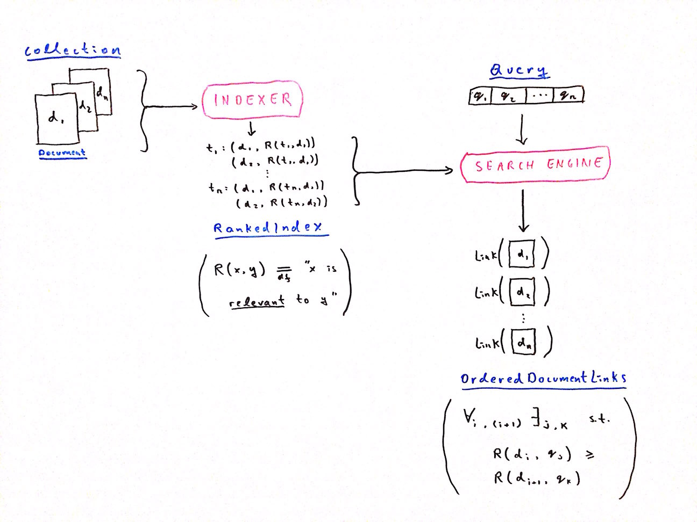

Offline indexing for documentation to make it searchable.

### Overview

The Indexer is intended to be used as part of an [information retrieval](https://en.wikipedia.org/wiki/Information_retrieval) system, a search engine. It's responsible for extracting an [inverted index](https://en.wikipedia.org/wiki/Inverted_index) from a `Collection` of `Document`s. The index maps terms `t` from the vocabulary set of the `Collection` to pairs `(d, R(t, d))`, where `d` is a `Document` identifier and `R(t, d)` is the [relevance](https://en.wikipedia.org/wiki/Relevance_(information_retrieval)) of term `t` to document `d`. How this index is used to produce an ordered list of `Document` links is left up to the Search Engine.



### Install

- Clone this repository and `cd` into it.

- Download [Bosh](http://bosh.io) documentation from [Cloud Foundry](https://pivotal.io/platform) by issuing:
  ```bash
  go get -v github.com/cloudfoundry/docs-bosh
  ```
  Alternatively you can modify *main.go* to point to your documentation.

### Index

```bash
make
```

If successful, this will yield an *index.json* file containing an inverted index of your documentation.

### Test

```bash
make test
```
